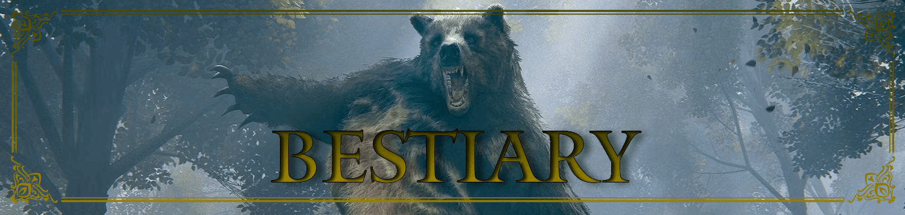

# BESTIARY

The Lands Between is a realm teeming with bizarre and terrifying creatures. From the grotesque, mutated demi-humans to the towering, ancient dragons, the bestiary is as diverse as it is deadly. These creatures are not mere obstacles, but intricate pieces of a grand tapestry, their existence tied to the land's history and the Elden Ring itself. Understanding their nature, weaknesses, and origins is crucial for any Tarnished seeking to restore order to the realm.
