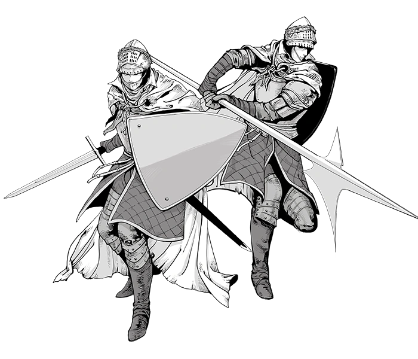
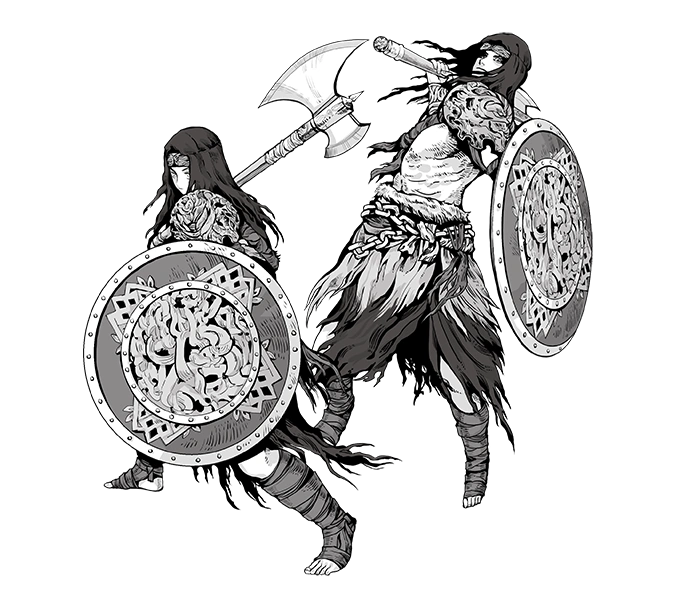

# CLASSES
## Elden Ring Classes
### Vagabond

    

        <h3>Vagabond</h3>
        
The Vagabond has high Vigor, Strength and Dexterity. It starts with a sword, shield and halberd

        <table>
            <thead>
                <tr>
                    <th colspan="4">STATS</th>
                </tr>
            </thead>
            <tbody>
                <tr>
                    <td>VIG</td>
                    <td>15</td>
                    <td>+1d8</td>
                    <td>+3</td>
                </tr>
                <tr>
                    <td>MIN</td>
                    <td>10</td>
                    <td>+1d8</td>
                    <td>-3</td>
                </tr>
                <tr>
                    <td>END</td>
                    <td>11</td>
                    <td>+1d8</td>
                    <td>+5</td>
                </tr>
                <tr>
                    <td>STR</td>
                    <td>14</td>
                    <td>+1d8</td>
                    <td>+6</td>
                </tr>
                <tr>
                    <td>DEX</td>
                    <td>13</td>
                    <td>+1d8</td>
                    <td>+5</td>
                </tr>
                <tr>
                    <td>INT</td>
                    <td>9</td>
                    <td>+1d8</td>
                    <td>-6</td>
                </tr>
                <tr>
                    <td>FAI</td>
                    <td>9</td>
                    <td>+1d8</td>
                    <td>-3</td>
                </tr>
                <tr>
                    <td>ARC</td>
                    <td>7</td>
                    <td>+1d8</td>
                    <td>-6</td>
                </tr>
            </tbody>
        </table>
    

    

        
    

    

        <h3>Warrior</h3>
        
Description de la classe suivante

        <table>
          <thead>
              <tr>
                  <th colspan="4">STATS</th>
              </tr>
          </thead>
          <tbody>
              <tr>
                  <td>VIG</td>
                  <td>15</td>
                  <td>+1d8</td>
                  <td>+3</td>
              </tr>
              <tr>
                  <td>MIN</td>
                  <td>10</td>
                  <td>+1d8</td>
                  <td>-3</td>
              </tr>
              <tr>
                  <td>END</td>
                  <td>11</td>
                  <td>+1d8</td>
                  <td>+5</td>
              </tr>
              <tr>
                  <td>STR</td>
                  <td>14</td>
                  <td>+1d8</td>
                  <td>+6</td>
              </tr>
              <tr>
                  <td>DEX</td>
                  <td>13</td>
                  <td>+1d8</td>
                  <td>+5</td>
              </tr>
              <tr>
                  <td>INT</td>
                  <td>9</td>
                  <td>+1d8</td>
                  <td>-6</td>
              </tr>
              <tr>
                  <td>FAI</td>
                  <td>9</td>
                  <td>+1d8</td>
                  <td>-3</td>
              </tr>
              <tr>
                  <td>ARC</td>
                  <td>7</td>
                  <td>+1d8</td>
                  <td>-6</td>
              </tr>
          </tbody>
      </table>
    

    

        
    

  

      <h3>Vagabond</h3>
      
The Vagabond has high Vigor, Strength and Dexterity. It starts with a sword, shield and halberd

      <table>
          <thead>
              <tr>
                  <th colspan="4">STATS</th>
              </tr>
          </thead>
          <tbody>
              <tr>
                  <td>VIG</td>
                  <td>15</td>
                  <td>+1d8</td>
                  <td>+3</td>
              </tr>
              <tr>
                  <td>MIN</td>
                  <td>10</td>
                  <td>+1d8</td>
                  <td>-3</td>
              </tr>
              <tr>
                  <td>END</td>
                  <td>11</td>
                  <td>+1d8</td>
                  <td>+5</td>
              </tr>
              <tr>
                  <td>STR</td>
                  <td>14</td>
                  <td>+1d8</td>
                  <td>+6</td>
              </tr>
              <tr>
                  <td>DEX</td>
                  <td>13</td>
                  <td>+1d8</td>
                  <td>+5</td>
              </tr>
              <tr>
                  <td>INT</td>
                  <td>9</td>
                  <td>+1d8</td>
                  <td>-6</td>
              </tr>
              <tr>
                  <td>FAI</td>
                  <td>9</td>
                  <td>+1d8</td>
                  <td>-3</td>
              </tr>
              <tr>
                  <td>ARC</td>
                  <td>7</td>
                  <td>+1d8</td>
                  <td>-6</td>
              </tr>
          </tbody>
      </table>
  

  

      
  

  

      <h3>Warrior</h3>
      
Description de la classe suivante

      <table>
        <thead>
            <tr>
                <th colspan="4">STATS</th>
            </tr>
        </thead>
        <tbody>
            <tr>
                <td>VIG</td>
                <td>15</td>
                <td>+1d8</td>
                <td>+3</td>
            </tr>
            <tr>
                <td>MIN</td>
                <td>10</td>
                <td>+1d8</td>
                <td>-3</td>
            </tr>
            <tr>
                <td>END</td>
                <td>11</td>
                <td>+1d8</td>
                <td>+5</td>
            </tr>
            <tr>
                <td>STR</td>
                <td>14</td>
                <td>+1d8</td>
                <td>+6</td>
            </tr>
            <tr>
                <td>DEX</td>
                <td>13</td>
                <td>+1d8</td>
                <td>+5</td>
            </tr>
            <tr>
                <td>INT</td>
                <td>9</td>
                <td>+1d8</td>
                <td>-6</td>
            </tr>
            <tr>
                <td>FAI</td>
                <td>9</td>
                <td>+1d8</td>
                <td>-3</td>
            </tr>
            <tr>
                <td>ARC</td>
                <td>7</td>
                <td>+1d8</td>
                <td>-6</td>
            </tr>
        </tbody>
    </table>
  

  

      
  

    <h3>Vagabond</h3>
    
The Vagabond has high Vigor, Strength and Dexterity. It starts with a sword, shield and halberd

    <table>
        <thead>
            <tr>
                <th colspan="4">STATS</th>
            </tr>
        </thead>
        <tbody>
            <tr>
                <td>VIG</td>
                <td>15</td>
                <td>+1d8</td>
                <td>+3</td>
            </tr>
            <tr>
                <td>MIN</td>
                <td>10</td>
                <td>+1d8</td>
                <td>-3</td>
            </tr>
            <tr>
                <td>END</td>
                <td>11</td>
                <td>+1d8</td>
                <td>+5</td>
            </tr>
            <tr>
                <td>STR</td>
                <td>14</td>
                <td>+1d8</td>
                <td>+6</td>
            </tr>
            <tr>
                <td>DEX</td>
                <td>13</td>
                <td>+1d8</td>
                <td>+5</td>
            </tr>
            <tr>
                <td>INT</td>
                <td>9</td>
                <td>+1d8</td>
                <td>-6</td>
            </tr>
            <tr>
                <td>FAI</td>
                <td>9</td>
                <td>+1d8</td>
                <td>-3</td>
            </tr>
            <tr>
                <td>ARC</td>
                <td>7</td>
                <td>+1d8</td>
                <td>-6</td>
            </tr>
        </tbody>
    </table>

    

  

      <h3>Warrior</h3>
      
Description de la classe suivante

      <table>
        <thead>
            <tr>
                <th colspan="4">STATS</th>
            </tr>
        </thead>
        <tbody>
            <tr>
                <td>VIG</td>
                <td>15</td>
                <td>+1d8</td>
                <td>+3</td>
            </tr>
            <tr>
                <td>MIN</td>
                <td>10</td>
                <td>+1d8</td>
                <td>-3</td>
            </tr>
            <tr>
                <td>END</td>
                <td>11</td>
                <td>+1d8</td>
                <td>+5</td>
            </tr>
            <tr>
                <td>STR</td>
                <td>14</td>
                <td>+1d8</td>
                <td>+6</td>
            </tr>
            <tr>
                <td>DEX</td>
                <td>13</td>
                <td>+1d8</td>
                <td>+5</td>
            </tr>
            <tr>
                <td>INT</td>
                <td>9</td>
                <td>+1d8</td>
                <td>-6</td>
            </tr>
            <tr>
                <td>FAI</td>
                <td>9</td>
                <td>+1d8</td>
                <td>-3</td>
            </tr>
            <tr>
                <td>ARC</td>
                <td>7</td>
                <td>+1d8</td>
                <td>-6</td>
            </tr>
        </tbody>
    </table>
  

  

      
  

    <h3>Vagabond</h3>
    
The Vagabond has high Vigor, Strength and Dexterity. It starts with a sword, shield and halberd

    <table>
        <thead>
            <tr>
                <th colspan="4">STATS</th>
            </tr>
        </thead>
        <tbody>
            <tr>
                <td>VIG</td>
                <td>15</td>
                <td>+1d8</td>
                <td>+3</td>
            </tr>
            <tr>
                <td>MIN</td>
                <td>10</td>
                <td>+1d8</td>
                <td>-3</td>
            </tr>
            <tr>
                <td>END</td>
                <td>11</td>
                <td>+1d8</td>
                <td>+5</td>
            </tr>
            <tr>
                <td>STR</td>
                <td>14</td>
                <td>+1d8</td>
                <td>+6</td>
            </tr>
            <tr>
                <td>DEX</td>
                <td>13</td>
                <td>+1d8</td>
                <td>+5</td>
            </tr>
            <tr>
                <td>INT</td>
                <td>9</td>
                <td>+1d8</td>
                <td>-6</td>
            </tr>
            <tr>
                <td>FAI</td>
                <td>9</td>
                <td>+1d8</td>
                <td>-3</td>
            </tr>
            <tr>
                <td>ARC</td>
                <td>7</td>
                <td>+1d8</td>
                <td>-6</td>
            </tr>
        </tbody>
    </table>

    

  

      <h3>Warrior</h3>
      
Description de la classe suivante

      <table>
        <thead>
            <tr>
                <th colspan="4">STATS</th>
            </tr>
        </thead>
        <tbody>
            <tr>
                <td>VIG</td>
                <td>15</td>
                <td>+1d8</td>
                <td>+3</td>
            </tr>
            <tr>
                <td>MIN</td>
                <td>10</td>
                <td>+1d8</td>
                <td>-3</td>
            </tr>
            <tr>
                <td>END</td>
                <td>11</td>
                <td>+1d8</td>
                <td>+5</td>
            </tr>
            <tr>
                <td>STR</td>
                <td>14</td>
                <td>+1d8</td>
                <td>+6</td>
            </tr>
            <tr>
                <td>DEX</td>
                <td>13</td>
                <td>+1d8</td>
                <td>+5</td>
            </tr>
            <tr>
                <td>INT</td>
                <td>9</td>
                <td>+1d8</td>
                <td>-6</td>
            </tr>
            <tr>
                <td>FAI</td>
                <td>9</td>
                <td>+1d8</td>
                <td>-3</td>
            </tr>
            <tr>
                <td>ARC</td>
                <td>7</td>
                <td>+1d8</td>
                <td>-6</td>
            </tr>
        </tbody>
    </table>
  

  

      
  

    <h3>Vagabond</h3>
    
The Vagabond has high Vigor, Strength and Dexterity. It starts with a sword, shield and halberd

    <table>
        <thead>
            <tr>
                <th colspan="4">STATS</th>
            </tr>
        </thead>
        <tbody>
            <tr>
                <td>VIG</td>
                <td>15</td>
                <td>+1d8</td>
                <td>+3</td>
            </tr>
            <tr>
                <td>MIN</td>
                <td>10</td>
                <td>+1d8</td>
                <td>-3</td>
            </tr>
            <tr>
                <td>END</td>
                <td>11</td>
                <td>+1d8</td>
                <td>+5</td>
            </tr>
            <tr>
                <td>STR</td>
                <td>14</td>
                <td>+1d8</td>
                <td>+6</td>
            </tr>
            <tr>
                <td>DEX</td>
                <td>13</td>
                <td>+1d8</td>
                <td>+5</td>
            </tr>
            <tr>
                <td>INT</td>
                <td>9</td>
                <td>+1d8</td>
                <td>-6</td>
            </tr>
            <tr>
                <td>FAI</td>
                <td>9</td>
                <td>+1d8</td>
                <td>-3</td>
            </tr>
            <tr>
                <td>ARC</td>
                <td>7</td>
                <td>+1d8</td>
                <td>-6</td>
            </tr>
        </tbody>
    </table>

    

  

      <h3>Warrior</h3>
      
Description de la classe suivante

      <table>
        <thead>
            <tr>
                <th colspan="4">STATS</th>
            </tr>
        </thead>
        <tbody>
            <tr>
                <td>VIG</td>
                <td>15</td>
                <td>+1d8</td>
                <td>+3</td>
            </tr>
            <tr>
                <td>MIN</td>
                <td>10</td>
                <td>+1d8</td>
                <td>-3</td>
            </tr>
            <tr>
                <td>END</td>
                <td>11</td>
                <td>+1d8</td>
                <td>+5</td>
            </tr>
            <tr>
                <td>STR</td>
                <td>14</td>
                <td>+1d8</td>
                <td>+6</td>
            </tr>
            <tr>
                <td>DEX</td>
                <td>13</td>
                <td>+1d8</td>
                <td>+5</td>
            </tr>
            <tr>
                <td>INT</td>
                <td>9</td>
                <td>+1d8</td>
                <td>-6</td>
            </tr>
            <tr>
                <td>FAI</td>
                <td>9</td>
                <td>+1d8</td>
                <td>-3</td>
            </tr>
            <tr>
                <td>ARC</td>
                <td>7</td>
                <td>+1d8</td>
                <td>-6</td>
            </tr>
        </tbody>
    </table>
  

  

      
  

    <h3>Vagabond</h3>
    
The Vagabond has high Vigor, Strength and Dexterity. It starts with a sword, shield and halberd

    <table>
        <thead>
            <tr>
                <th colspan="4">STATS</th>
            </tr>
        </thead>
        <tbody>
            <tr>
                <td>VIG</td>
                <td>15</td>
                <td>+1d8</td>
                <td>+3</td>
            </tr>
            <tr>
                <td>MIN</td>
                <td>10</td>
                <td>+1d8</td>
                <td>-3</td>
            </tr>
            <tr>
                <td>END</td>
                <td>11</td>
                <td>+1d8</td>
                <td>+5</td>
            </tr>
            <tr>
                <td>STR</td>
                <td>14</td>
                <td>+1d8</td>
                <td>+6</td>
            </tr>
            <tr>
                <td>DEX</td>
                <td>13</td>
                <td>+1d8</td>
                <td>+5</td>
            </tr>
            <tr>
                <td>INT</td>
                <td>9</td>
                <td>+1d8</td>
                <td>-6</td>
            </tr>
            <tr>
                <td>FAI</td>
                <td>9</td>
                <td>+1d8</td>
                <td>-3</td>
            </tr>
            <tr>
                <td>ARC</td>
                <td>7</td>
                <td>+1d8</td>
                <td>-6</td>
            </tr>
        </tbody>
    </table>

    

  

      <h3>Warrior</h3>
      
Description de la classe suivante

      <table>
        <thead>
            <tr>
                <th colspan="4">STATS</th>
            </tr>
        </thead>
        <tbody>
            <tr>
                <td>VIG</td>
                <td>15</td>
                <td>+1d8</td>
                <td>+3</td>
            </tr>
            <tr>
                <td>MIN</td>
                <td>10</td>
                <td>+1d8</td>
                <td>-3</td>
            </tr>
            <tr>
                <td>END</td>
                <td>11</td>
                <td>+1d8</td>
                <td>+5</td>
            </tr>
            <tr>
                <td>STR</td>
                <td>14</td>
                <td>+1d8</td>
                <td>+6</td>
            </tr>
            <tr>
                <td>DEX</td>
                <td>13</td>
                <td>+1d8</td>
                <td>+5</td>
            </tr>
            <tr>
                <td>INT</td>
                <td>9</td>
                <td>+1d8</td>
                <td>-6</td>
            </tr>
            <tr>
                <td>FAI</td>
                <td>9</td>
                <td>+1d8</td>
                <td>-3</td>
            </tr>
            <tr>
                <td>ARC</td>
                <td>7</td>
                <td>+1d8</td>
                <td>-6</td>
            </tr>
        </tbody>
    </table>
  

  

      
  

    <h3>Vagabond</h3>
    
The Vagabond has high Vigor, Strength and Dexterity. It starts with a sword, shield and halberd

    <table>
        <thead>
            <tr>
                <th colspan="4">STATS</th>
            </tr>
        </thead>
        <tbody>
            <tr>
                <td>VIG</td>
                <td>15</td>
                <td>+1d8</td>
                <td>+3</td>
            </tr>
            <tr>
                <td>MIN</td>
                <td>10</td>
                <td>+1d8</td>
                <td>-3</td>
            </tr>
            <tr>
                <td>END</td>
                <td>11</td>
                <td>+1d8</td>
                <td>+5</td>
            </tr>
            <tr>
                <td>STR</td>
                <td>14</td>
                <td>+1d8</td>
                <td>+6</td>
            </tr>
            <tr>
                <td>DEX</td>
                <td>13</td>
                <td>+1d8</td>
                <td>+5</td>
            </tr>
            <tr>
                <td>INT</td>
                <td>9</td>
                <td>+1d8</td>
                <td>-6</td>
            </tr>
            <tr>
                <td>FAI</td>
                <td>9</td>
                <td>+1d8</td>
                <td>-3</td>
            </tr>
            <tr>
                <td>ARC</td>
                <td>7</td>
                <td>+1d8</td>
                <td>-6</td>
            </tr>
        </tbody>
    </table>

    

  

      <h3>Warrior</h3>
      
Description de la classe suivante

      <table>
        <thead>
            <tr>
                <th colspan="4">STATS</th>
            </tr>
        </thead>
        <tbody>
            <tr>
                <td>VIG</td>
                <td>15</td>
                <td>+1d8</td>
                <td>+3</td>
            </tr>
            <tr>
                <td>MIN</td>
                <td>10</td>
                <td>+1d8</td>
                <td>-3</td>
            </tr>
            <tr>
                <td>END</td>
                <td>11</td>
                <td>+1d8</td>
                <td>+5</td>
            </tr>
            <tr>
                <td>STR</td>
                <td>14</td>
                <td>+1d8</td>
                <td>+6</td>
            </tr>
            <tr>
                <td>DEX</td>
                <td>13</td>
                <td>+1d8</td>
                <td>+5</td>
            </tr>
            <tr>
                <td>INT</td>
                <td>9</td>
                <td>+1d8</td>
                <td>-6</td>
            </tr>
            <tr>
                <td>FAI</td>
                <td>9</td>
                <td>+1d8</td>
                <td>-3</td>
            </tr>
            <tr>
                <td>ARC</td>
                <td>7</td>
                <td>+1d8</td>
                <td>-6</td>
            </tr>
        </tbody>
    </table>
  

  

      
  

