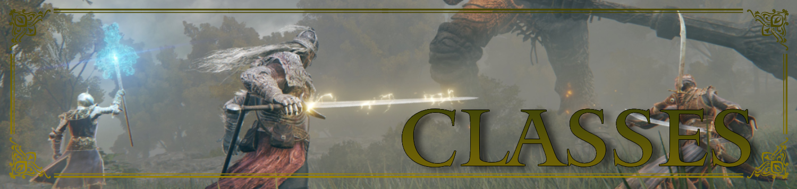

# Elden Ring TTRPG Classes

Welcome to the Classes section of the Elden Ring Tabletop Role-Playing Game! This folder contains detailed information on the diverse classes available for your character. Each class offers unique abilities, strengths, and playstyles, allowing you to craft a hero that suits your preferred way of adventuring. Explore the sections below:

- **Class Overviews**: Descriptions of each class, including their core attributes and general playstyle.
- **Abilities & Skills**: Detailed breakdowns of the special abilities, spells, and skills each class can master.
- **Class Progression**: Information on how each class evolves as your character levels up, including advanced abilities and perks.
- **Equipment & Gear**: Suggested starting equipment and gear tailored to each class.

Your choice of class is the first step in defining your role in the world of Elden Ring. Whether you prefer the brute strength of a warrior, the mystical powers of a sorcerer, or the versatility of a rogue, each path offers its own challenges and rewards. Choose wisely, Tarnished, for your class will shape your destiny. Forge your legend and let your skills be your guide!