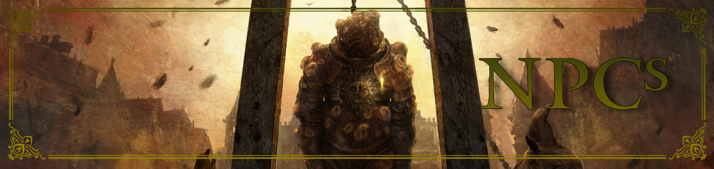

# Elden Ring TTRPG NPCs

Welcome to the NPCs section of the Elden Ring Tabletop Role-Playing Game! This folder contains detailed information on the non-player characters (NPCs) you'll encounter throughout your journey. These characters, each with their own motives, backstories, and roles, can be allies, enemies, or something in between. Explore the sections below:

- **Major NPC Profiles**: Detailed descriptions, lore, and roles of key NPCs in the world.
- **Quest-Givers & Merchants**: Information on NPCs who offer quests, items, and services to aid you on your journey.
- **Allies & Foes**: Descriptions of NPCs who may join your cause or stand in your way.
- **Dialogue & Interaction**: Guidelines for interacting with NPCs, including potential outcomes based on your choices.

The NPCs of Elden Ring are more than just characters—they are the threads that weave the fabric of your story. Each interaction has the potential to change your path, for better or worse. Choose your words carefully, Tarnished, and remember that every NPC has a part to play in the grand tapestry of your adventure. May your allies be true, and your enemies fall before you!