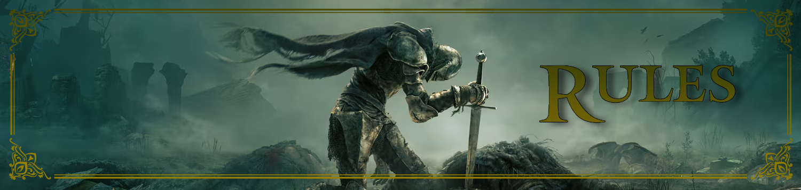

# Elden Ring TTRPG Rules

Welcome to Elden Ring Tabletop Role-Playing Game! This folder contains all the essential rules and guidelines you need to embark on epic adventures. Dive into the sections below to get started:

- **Character Creation**: Steps to build your unique character.
- **Gameplay Mechanics**: Core rules governing actions, skill checks, and interactions.
- **Combat System**: Detailed procedures for engaging in battles.
- **Magic & Abilities**: Descriptions of magical systems and special powers.
- **World Lore**: Background information about the game's universe and settings.

May these rules guide you as you navigate the perilous and wondrous world of Elden Ring. With every decision, roll of the dice, and encounter, you'll shape your own destiny. Remember, the journey is just as important as the destination—embrace the challenges, forge bonds with your fellow players, and let your story unfold.

Prepare yourself, Tarnished, for the path ahead is treacherous, but the rewards are beyond measure. May fortune favor you on your adventure!